# 03. DB 설계

> 기준 문서: [01 MVP 범위](01_mvp_scope.md), [02 용어 정의](02_glossary.md), [99 결정 기록](99_decisions.md)
> DB: PostgreSQL (Neon). 이 문서는 **무엇을, 왜 이렇게** 저장하는지를 다룬다.
> 저장된 데이터를 어떤 규칙으로 바꾸는지(검증, 상태 이동)는 04 비즈니스 규칙에서 다룬다.

---

## 1. 설계 원칙

### 원칙 1. 돈의 원본은 원장 하나다
조합원의 약정·납입·분배 금액은 `ledger_entries`(원장)에만 저장한다.
"LP A의 누적 납입액" 같은 합계는 **저장하지 않고 필요할 때마다 원장에서 계산**한다 (6장의 뷰).

> **왜?** 합계를 따로 저장하면 원장과 합계 두 곳을 항상 같이 바꿔야 한다.
> 하나라도 빠뜨리면 숫자가 어긋나고, 어느 쪽이 맞는지 알 수 없게 된다.
> 원본이 하나면 숫자는 절대 어긋나지 않는다.

### 원칙 2. 업무 문서와 원장을 분리한다
- **업무 문서**: "무엇을 요청·결정했는가" (캐피탈콜 요청, 분배 결정, 투자 집행)
- **원장**: "실제로 확정된 돈이 무엇인가" (약정 확정, 납입 완료, 분배 지급)

캐피탈콜을 보냈다고 돈이 들어온 게 아니다. 요청은 `capital_call_items`에, 실제 납입은 원장에 기록한다.
원장의 모든 행은 **어떤 업무 문서 때문에 생겼는지**(`source_type`, `source_id`)를 가리킨다.

### 원칙 3. 원장은 추가만 한다 (D5)
원장 행은 수정·삭제하지 않는다. 틀렸으면 **반대 금액의 취소 행**을 추가하고, 올바른 행을 다시 추가한다.

```
1) 납입   +100,000,000   (잘못 입력)
2) 납입   -100,000,000   (1번 취소, reversal_of_id = 1)
3) 납입   +110,000,000   (올바른 금액)
합계 = 110,000,000
```

> **왜?** 누가 언제 무엇을 바꿨는지 전부 남는다. 실제 회계 시스템과 같은 방식이고,
> LP 시스템이 "변경 이력"을 그대로 보여줄 수 있다.

### 원칙 4. 결정 시점의 값을 고정해서 저장한다 (스냅샷)
지분율, 규약 조건은 시간이 지나며 바뀔 수 있다. 그래서 **결정이 내려진 시점의 값**을 함께 저장한다.
- 총회 의결: 의결 당시의 의결권 비율을 `votes`에 저장
- 정기 보고: 발송 당시의 펀드 숫자를 `reports.snapshot`에 저장
- 캐피탈콜·분배: 조합원별 금액을 계산 결과 그대로 저장

> **왜?** 나중에 약정이 바뀌어도 "그때 왜 이 금액을 요청했는지"를 설명할 수 있어야 한다.

### 원칙 5. LP 시스템을 위해 준비한다 (D2)
- 모든 기본 키는 **UUID**(무작위로 만든 고유 ID)를 쓴다. 두 시스템이 서로의 ID를 그대로 주고받을 수 있다
- 출자자는 펀드와 독립된 `limited_partners`로 관리한다
- GP → LP로 가는 모든 요청은 `notices`로, LP 시스템에 알려야 할 변경은 `integration_events`로 기록한다
- 테이블마다 **LP 공개 등급**을 정한다 (7장)

---

## 2. 전체 구조 (ERD)

> VS Code에서 아래 그림을 보려면 Mermaid 미리보기 확장이 필요하다 (GitHub에서는 바로 보인다).

```mermaid
erDiagram
    users ||--o{ deals : "담당"

    limited_partners ||--o{ lp_proposals : "제안받음"
    limited_partners ||--o{ fund_members : "조합원으로 참여"

    funds ||--o{ fund_terms : "규약 버전"
    funds ||--o{ related_institutions : "관계 기관"
    funds ||--o{ lp_proposals : "모집"
    funds ||--o{ fund_members : "조합원"
    funds ||--o{ ledger_entries : "원장"
    funds ||--o{ capital_calls : "출자 요청"
    funds ||--o{ investments : "투자"
    funds ||--o{ valuations : "평가"
    funds ||--o{ exits : "회수"
    funds ||--o{ management_fee_charges : "관리보수"
    funds ||--o{ distributions : "분배"
    funds ||--o{ general_meetings : "총회"
    funds ||--o{ reports : "보고"
    funds ||--o{ notices : "통지"

    fund_members ||--o{ ledger_entries : "돈의 흐름"
    fund_members ||--o{ capital_call_items : "요청받음"
    fund_members ||--o{ distribution_items : "분배받음"
    fund_members ||--o{ votes : "의결"

    capital_calls ||--o{ capital_call_items : "조합원별"
    distributions ||--o{ distribution_items : "조합원별"

    companies ||--o{ deals : "검토 대상"
    companies ||--o{ investments : "투자받음"
    companies ||--o{ valuations : "평가받음"
    companies ||--o{ exits : "회수"
    deals ||--o{ deal_stage_history : "단계 이력"
    deals ||--o{ deal_notes : "메모"
    deals ||--o{ investments : "집행"

    general_meetings ||--o{ agendas : "안건"
    agendas ||--o{ votes : "투표"
    agendas ||--o| fund_terms : "규약 변경 근거"

    notices ||--o{ notice_recipients : "수신자"
    limited_partners ||--o{ notice_recipients : "수신"
```



### 영역별 요약

| 영역 | 테이블 | 단계 |
|---|---|---|
| 기준 정보 | `users`, `limited_partners`, `companies` | 공통 |
| 펀드 | `funds`, `fund_terms`, `related_institutions` | 1. 기획, 3. 결성 |
| 모집·조합원 | `lp_proposals`, `fund_members` | 2. 모집, 3. 결성 |
| 돈의 원장 | `ledger_entries` | 전 단계 |
| 출자 요청 | `capital_calls`, `capital_call_items` | 3. 결성, 4. 운용 |
| 투자 | `deals`, `deal_stage_history`, `deal_notes`, `investments`, `valuations` | 4. 운용 |
| 보수 | `management_fee_charges` | 4. 운용 |
| 총회·보고 | `general_meetings`, `agendas`, `votes`, `reports` | 5. 보고·총회 |
| 회수·분배 | `exits`, `distributions`, `distribution_items` | 6. 회수·청산 |
| LP 연동 | `notices`, `notice_recipients`, `integration_events` | 전 단계 |
| API 공통 | `idempotency_keys` | 전 단계 |

테이블 28개, 계산용 뷰 4개.

---

## 3. 공통 컬럼과 자료형

모든 테이블은 아래 컬럼을 가진다 (원장처럼 수정이 없는 테이블은 `updated_at` 제외).

| 컬럼 | 자료형 | 설명 |
|---|---|---|
| `id` | `uuid` | 기본 키. DB가 자동 생성 |
| `created_at` | `timestamptz` | 생성 일시. 기본값 현재 시각 |
| `updated_at` | `timestamptz` | 수정 일시 |
| `created_by` | `uuid` → `users` | 작성자 (사람이 입력하는 테이블만) |

| 값의 종류 | 자료형 | 이유 |
|---|---|---|
| 금액 | `bigint` | 원 단위 정수 (D3). 최대 약 900경 원까지 저장 가능 |
| 비율 | `numeric(7,6)` | 소수 6자리까지 정확하게 저장 (예: 0.333333). 실수형(`float`)은 오차가 생겨 쓰지 않는다 |
| 상태·구분값 | `text` + `check` 제약 | 정해진 값 외에는 DB가 거부한다 |
| 날짜 | `date` / 일시 `timestamptz` | 일시는 시간대 포함으로 저장 |

---

## 4. 테이블 상세

> 표기: 🔑 기본 키 · 🔗 외래 키(다른 테이블을 가리킴) · ❗ 필수 값 · ✨ 유일해야 함

### 4-1. 기준 정보

#### `users` — GP 사용자
| 컬럼 | 자료형 | 설명 |
|---|---|---|
| 🔑 `id` | uuid | |
| ❗✨ `email` | text | 로그인 ID |
| ❗ `name` | text | |
| ❗ `password_hash` | text | 비밀번호를 복원할 수 없게 변환한 값. 원문은 저장하지 않는다 |

> **설계 의도**: MVP는 권한 구분 없이 GP 사용자 1종만 둔다. LP 계정은 LP 시스템 DB에 둔다 (D2).

#### `limited_partners` — 출자자 기준 정보
| 컬럼 | 자료형 | 설명 |
|---|---|---|
| 🔑 `id` | uuid | LP 시스템 계정과 연결되는 ID |
| ❗ `name` | text | 기관명 또는 개인 이름 |
| ❗ `lp_type` | text | `policy` / `pension` / `financial` / `corporate` / `individual` / `other` |
| ✨ `registration_no` | text | 사업자등록번호 (개인은 비움) |
| `contact_name`, `contact_email`, `contact_phone` | text | 담당자 |
| `memo` | text | GP 내부 메모 (LP 비공개) |

> **설계 의도**: 출자자를 펀드에 종속시키지 않는다. 같은 LP가 1호 펀드, 2호 펀드에 모두 출자해도
> 한 행으로 관리되고, "이 LP의 전체 출자 현황"을 볼 수 있다. LP 시스템 로그인 계정도 이 ID에 연결된다.

#### `companies` — 기업 기준 정보
| 컬럼 | 자료형 | 설명 |
|---|---|---|
| 🔑 `id` | uuid | |
| ❗ `name` | text | |
| ✨ `registration_no` | text | 사업자등록번호 |
| `sector` | text | 산업 분야 |
| `ceo_name` | text | |
| `founded_date` | date | 설립일 (초기 기업 여부 판단에 사용) |

> **설계 의도**: 검토 중인 기업과 투자한 기업을 한 테이블에 둔다.
> 딜이 드롭됐다가 1년 뒤 다시 검토되거나, 두 펀드가 같은 기업에 투자해도 기업 정보는 하나로 유지된다.
> "포트폴리오사"는 별도 테이블이 아니라 **투자가 1건 이상 있는 기업**을 보여주는 뷰로 만든다.

### 4-2. 펀드

#### `funds` — 펀드
| 컬럼 | 자료형 | 설명 |
|---|---|---|
| 🔑 `id` | uuid | |
| ❗ `name` | text | |
| ❗ `fund_type` | text | `venture` / `new_tech` |
| ❗ `status` | text | `planning` / `fundraising` / `formed` / `operating` / `dissolved` / `liquidated` |
| ❗ `target_amount` | bigint | 목표 결성액 |
| ❗ `term_years` | integer | 존속 기간 |
| ❗ `investment_period_years` | integer | 투자 기간. `term_years` 이하 |
| `formation_date` | date | 결성일 (결성 전에는 비움) |
| `registration_applied_date` | date | 등록 신청일 |
| `registration_completed_date` | date | 등록 완료일 |
| `dissolution_date` | date | 해산일 |
| `liquidation_date` | date | 청산 완료일 |

> **설계 의도**: 약정 총액, 만기일처럼 **다른 값으로 계산되는 값은 저장하지 않는다** (뷰에서 계산).
> 단계별 날짜를 컬럼으로 두어 펀드가 언제 어느 단계를 지났는지 한눈에 보이게 한다.

#### `fund_terms` — 규약 핵심 조건 (버전 관리)
| 컬럼 | 자료형 | 설명 |
|---|---|---|
| 🔑 `id` | uuid | |
| ❗🔗 `fund_id` | uuid → funds | |
| ❗ `version` | integer | 1부터 시작. `(fund_id, version)` ✨ |
| ❗ `primary_purpose` | text | 주목적 투자 분야 설명 |
| ❗ `primary_purpose_min_ratio` | numeric | 주목적 의무 비율 |
| ❗ `gp_commitment_min_ratio` | numeric | GP 의무 출자 비율 |
| ❗ `management_fee_rate` | numeric | 투자 기간 중 관리보수율 (약정 총액 기준) |
| ❗ `management_fee_rate_after` | numeric | 투자 기간 후 관리보수율 (투자 잔액 기준) ⚠️ |
| ❗ `carry_rate` | numeric | 성과보수율 |
| ❗ `hurdle_rate` | numeric | 기준수익률 |
| ❗ `quorum_ratio` | numeric | 총회 가결에 필요한 찬성 의결권 비율 ⚠️ |
| ❗ `effective_date` | date | 이 버전이 적용되기 시작한 날 |
| 🔗 `amended_by_agenda_id` | uuid → agendas | 이 버전을 만든 총회 안건. 최초 버전은 비움 |

> **설계 의도**: 규약 변경을 별도 테이블로 두지 않고 **조건 전체를 새 버전으로 한 행 추가**한다.
> 어떤 시점이든 "그때 적용된 규약"을 행 하나로 바로 꺼낼 수 있다.
> 결성 전(기획·모집)에는 버전 1을 자유롭게 고칠 수 있고, 결성 후에는 총회 가결 안건이 있어야만 새 버전을 추가할 수 있다 (04에서 규칙화).

#### `related_institutions` — 관계 기관
| 컬럼 | 자료형 | 설명 |
|---|---|---|
| 🔑 `id` | uuid | |
| ❗🔗 `fund_id` | uuid → funds | |
| ❗ `institution_type` | text | `custodian` / `administrator` / `auditor` |
| ❗ `name` | text | |
| `contact_name`, `contact_email`, `contact_phone` | text | |

### 4-3. 모집·조합원

#### `lp_proposals` — 출자 제안
| 컬럼 | 자료형 | 설명 |
|---|---|---|
| 🔑 `id` | uuid | |
| ❗🔗 `fund_id` | uuid → funds | |
| ❗🔗 `lp_id` | uuid → limited_partners | `(fund_id, lp_id)` ✨ 한 펀드에 한 LP는 제안 1건 |
| ❗ `status` | text | `proposed` / `reviewing` / `committed` / `declined` |
| `proposed_amount` | bigint | GP가 제안한 출자 금액 |
| `loc_amount` | bigint | LP가 확약한 금액. `committed` 일 때 필수 |
| ❗ `proposed_date` | date | |
| `decided_date` | date | 확약 또는 거절한 날 |
| `memo` | text | GP 내부 메모 |

> **설계 의도**: 모집 단계의 "확약"과 결성 단계의 "약정"을 구분한다.
> 확약은 결성 전 약속이라 바뀔 수 있고, 약정은 결성총회에서 확정된 법적 금액이다.
> 결성 시 `committed` 제안을 바탕으로 조합원(`fund_members`)과 약정 원장이 만들어진다.

#### `fund_members` — 조합원
| 컬럼 | 자료형 | 설명 |
|---|---|---|
| 🔑 `id` | uuid | |
| ❗🔗 `fund_id` | uuid → funds | |
| ❗ `member_type` | text | `gp` / `lp` |
| 🔗 `lp_id` | uuid → limited_partners | `lp` 일 때 필수, `gp` 일 때 비움. `(fund_id, lp_id)` ✨ |
| 🔗 `proposal_id` | uuid → lp_proposals | 어떤 제안에서 조합원이 됐는지 |
| ❗ `joined_date` | date | |

> **설계 의도**: GP도 자기 펀드에 출자하는 조합원이므로 LP와 같은 테이블에 둔다.
> 그래야 캐피탈콜·의결·분배를 계산할 때 GP를 빠뜨리지 않는다.
> 펀드당 GP 조합원은 1명만 허용한다 (부분 유일 제약).
> **약정액 컬럼이 없는 이유**: 약정액은 원장에만 있다 (원칙 1).

### 4-4. 돈의 원장

#### `ledger_entries` — 조합원 원장
| 컬럼 | 자료형 | 설명 |
|---|---|---|
| 🔑 `id` | uuid | |
| ❗🔗 `fund_id` | uuid → funds | |
| ❗🔗 `member_id` | uuid → fund_members | |
| ❗ `entry_type` | text | `commitment`(약정) / `contribution`(납입) / `distribution`(분배) |
| ❗ `amount` | bigint | 양수. 취소 행만 음수 |
| ❗ `entry_date` | date | 돈이 확정된 날 (약정일, 납입일, 지급일) |
| ❗ `source_type` | text | 원인 문서 종류: `formation` / `capital_call_item` / `distribution_item` / `terms_amendment` |
| ❗ `source_id` | uuid | 원인 문서 ID |
| 🔗 `reversal_of_id` | uuid → ledger_entries | 취소 행일 때 취소 대상 |
| `memo` | text | |
| ❗ `created_at`, `created_by` | | `updated_at` 없음 (수정 불가) |

> **설계 의도**
> - 조합원 돈의 **유일한 원본**. 약정·납입·분배 합계는 모두 여기서 계산한다.
> - **캐피탈콜 "요청"은 원장에 넣지 않는다.** 요청은 약속이 아니라 청구서일 뿐이라 `capital_call_items`에 둔다.
>   원장에는 확정된 돈(약정 확정, 실제 납입, 실제 지급)만 들어간다.
> - 수정·삭제는 DB 권한으로 막는다. 정정은 취소 행 + 새 행 (원칙 3).
> - `amount` 는 취소 행(`reversal_of_id` 있음)일 때만 음수를 허용한다 (check 제약).
> - LP 시스템은 이 테이블에서 **자기 행만** 받아가면 "내 약정·납입·분배 내역"이 완성된다.

### 4-5. 출자 요청 (캐피탈콜)

#### `capital_calls` — 출자 요청 (펀드 단위)
| 컬럼 | 자료형 | 설명 |
|---|---|---|
| 🔑 `id` | uuid | |
| ❗🔗 `fund_id` | uuid → funds | |
| ❗ `call_no` | integer | 펀드 내 회차 (1, 2, 3…). `(fund_id, call_no)` ✨ |
| ❗ `is_initial` | boolean | 결성 시 최초 납입 여부 |
| ❗ `total_call_amount` | bigint | 전체 요청액 |
| ❗ `call_date` | date | 요청일 |
| ❗ `due_date` | date | 납입 기한. `call_date` 이후 |
| `purpose` | text | 요청 목적 (예: "A사 투자 및 관리보수") |
| ❗ `status` | text | `draft`(작성) / `issued`(발송) / `closed`(마감) |

#### `capital_call_items` — 조합원별 요청
| 컬럼 | 자료형 | 설명 |
|---|---|---|
| 🔑 `id` | uuid | |
| ❗🔗 `capital_call_id` | uuid → capital_calls | |
| ❗🔗 `member_id` | uuid → fund_members | `(capital_call_id, member_id)` ✨ |
| ❗ `ownership_ratio` | numeric | 요청 당시 지분율 (스냅샷) |
| ❗ `call_amount` | bigint | 이 조합원에게 요청한 금액 |

> **설계 의도**
> - 조합원별 요청액을 **계산 결과 그대로 저장**한다 (원칙 4). 나누어 떨어지지 않는 1원 단위 차이를 어느 조합원에게 붙였는지까지 남는다 (04에서 규칙화).
> - 납입액 컬럼은 두지 않는다. 납입은 원장에 `source_type = 'capital_call_item'` 으로 기록되고, 납입 상태(대기·완납·일부·미납)는 뷰에서 계산한다.

### 4-6. 투자

#### `deals` — 딜
| 컬럼 | 자료형 | 설명 |
|---|---|---|
| 🔑 `id` | uuid | |
| ❗🔗 `company_id` | uuid → companies | |
| 🔗 `target_fund_id` | uuid → funds | 투자 예정 펀드 (검토 중에는 비워도 됨) |
| ❗ `stage` | text | `sourcing` / `reviewing` / `ic` / `approved` / `dropped` |
| `expected_amount` | bigint | 예상 투자 금액 |
| ❗🔗 `owner_id` | uuid → users | 담당 심사역 |
| ❗ `sourced_date` | date | 발굴일 |
| `drop_reason` | text | `dropped` 일 때 필수 |

#### `deal_stage_history` — 딜 단계 이력
| 컬럼 | 자료형 | 설명 |
|---|---|---|
| 🔑 `id` | uuid | |
| ❗🔗 `deal_id` | uuid → deals | |
| `from_stage` | text | 최초 등록 시 비움 |
| ❗ `to_stage` | text | |
| ❗ `changed_at`, `changed_by` | | |

> **설계 의도**: `deals.stage` 는 현재 단계만 보여준다. 이력을 따로 남겨야
> "발굴에서 투심위까지 평균 며칠 걸리는지", "어느 단계에서 가장 많이 드롭되는지"를 분석할 수 있다.

#### `deal_notes` — 딜 메모
| 컬럼 | 자료형 | 설명 |
|---|---|---|
| 🔑 `id` | uuid | |
| ❗🔗 `deal_id` | uuid → deals | |
| ❗ `stage` | text | 메모 작성 당시 단계 |
| ❗ `content` | text | |

#### `investments` — 투자 집행
| 컬럼 | 자료형 | 설명 |
|---|---|---|
| 🔑 `id` | uuid | |
| ❗🔗 `fund_id` | uuid → funds | |
| ❗🔗 `company_id` | uuid → companies | |
| 🔗 `deal_id` | uuid → deals | 신규 투자는 `approved` 딜 필수 |
| ❗ `investment_date` | date | |
| ❗ `investment_amount` | bigint | 0보다 큼 |
| ❗ `security_type` | text | `common` / `preferred` / `rcps` / `cb` / `bw` / `other` |
| `shares` | bigint | 취득 주식 수 (사채는 비움) |
| `price_per_share` | bigint | 주당 가격 |
| ❗ `is_follow_on` | boolean | 후속 투자 여부 |
| ❗ `is_primary_purpose` | boolean | 주목적 분야 해당 여부 |

> **설계 의도**: 투자 1건 = 1행. 같은 기업에 후속 투자하면 행이 추가된다.
> 펀드의 투자 가능 잔액은 저장하지 않고 뷰에서 계산하며, 잔액 초과 검증은 04에서 다룬다.

#### `valuations` — 기업가치 평가
| 컬럼 | 자료형 | 설명 |
|---|---|---|
| 🔑 `id` | uuid | |
| ❗🔗 `fund_id` | uuid → funds | |
| ❗🔗 `company_id` | uuid → companies | |
| ❗ `valuation_date` | date | `(fund_id, company_id, valuation_date)` ✨ |
| ❗ `fair_value_amount` | bigint | 펀드가 보유한 지분의 평가액 |
| `method` | text | 평가 방법 메모 ⚠️ |

> **설계 의도**: 평가는 투자 건이 아니라 **펀드가 보유한 기업 지분 전체** 단위로 한다.
> 가장 최근 평가액을 정기 보고와 대시보드에 쓴다.

### 4-7. 보수

#### `management_fee_charges` — 관리보수 청구
| 컬럼 | 자료형 | 설명 |
|---|---|---|
| 🔑 `id` | uuid | |
| ❗🔗 `fund_id` | uuid → funds | |
| ❗ `period_start`, `period_end` | date | 보수 산정 기간 |
| ❗ `fee_basis` | text | `commitment` / `invested` |
| ❗ `basis_amount` | bigint | 산정 기준 금액 (계산 당시 값) |
| ❗ `fee_rate` | numeric | 적용 보수율 (계산 당시 값) |
| ❗ `fee_amount` | bigint | 청구액 |
| ❗ `charged_date` | date | |

> **설계 의도**: 계산 결과만이 아니라 **계산에 쓴 재료(기준 금액, 요율, 기간)를 함께 저장**한다.
> LP나 감사인이 "이 보수가 왜 이 금액인가"를 물으면 행 하나로 답할 수 있다.
> 관리보수는 펀드 → GP로 나가는 돈이라 조합원 원장이 아니라 이 테이블에 둔다.

### 4-8. 총회·보고

#### `general_meetings` — 조합원 총회
| 컬럼 | 자료형 | 설명 |
|---|---|---|
| 🔑 `id` | uuid | |
| ❗🔗 `fund_id` | uuid → funds | |
| ❗ `meeting_type` | text | `formation` / `regular` / `extraordinary` / `dissolution` |
| ❗ `meeting_date` | date | |
| `location` | text | |
| ❗ `status` | text | `scheduled`(예정) / `held`(개최) / `cancelled`(취소) |

#### `agendas` — 안건
| 컬럼 | 자료형 | 설명 |
|---|---|---|
| 🔑 `id` | uuid | |
| ❗🔗 `meeting_id` | uuid → general_meetings | |
| ❗ `agenda_no` | integer | 총회 내 순번 |
| ❗ `agenda_type` | text | `formation` / `terms_amendment` / `report_approval` / `dissolution` / `other` |
| ❗ `title` | text | |
| `description` | text | |
| ❗ `quorum_ratio` | numeric | 가결 기준 (당시 규약에서 복사) |
| ❗ `result` | text | `pending` / `passed` / `rejected` |

#### `votes` — 의결
| 컬럼 | 자료형 | 설명 |
|---|---|---|
| 🔑 `id` | uuid | |
| ❗🔗 `agenda_id` | uuid → agendas | |
| ❗🔗 `member_id` | uuid → fund_members | `(agenda_id, member_id)` ✨ |
| ❗ `choice` | text | `for`(찬성) / `against`(반대) / `abstain`(기권) |
| ❗ `voting_power_ratio` | numeric | 의결 당시 의결권 비율 (스냅샷) |

> **설계 의도**: 결성총회도 `general_meetings` 한 종류로 다룬다.
> 결성·규약 변경·해산처럼 펀드 상태를 바꾸는 결정은 모두 **가결된 안건**을 근거로 남긴다.

#### `reports` — 정기 보고
| 컬럼 | 자료형 | 설명 |
|---|---|---|
| 🔑 `id` | uuid | |
| ❗🔗 `fund_id` | uuid → funds | |
| ❗ `period_type` | text | `quarterly` / `semiannual` / `annual` |
| ❗ `period_start`, `period_end` | date | |
| ❗ `snapshot` | jsonb | 발송 시점 펀드 숫자 묶음 (약정·납입·투자·평가·분배) |
| `gp_comment` | text | GP 코멘트 |
| ❗ `status` | text | `draft` / `published` |

> **설계 의도**: 보고서 숫자는 **발송 시점에 얼려서** `jsonb`(여러 값을 묶어 한 칸에 저장하는 형식)로 저장한다.
> 나중에 데이터가 바뀌어도 LP가 받은 보고서의 숫자는 그대로 남아야 한다.

### 4-9. 회수·분배

#### `exits` — 회수
| 컬럼 | 자료형 | 설명 |
|---|---|---|
| 🔑 `id` | uuid | |
| ❗🔗 `fund_id` | uuid → funds | |
| ❗🔗 `company_id` | uuid → companies | |
| ❗ `exit_type` | text | `ipo` / `trade_sale` / `m_and_a` / `redemption` / `write_off` |
| ❗ `exit_date` | date | |
| ❗ `proceeds_amount` | bigint | 회수 금액. 상각이면 0 |
| ❗ `cost_basis_amount` | bigint | 이번 회수에 해당하는 투자 원금 ⚠️ 일부 회수 시 원금 배분 방식 |

> **설계 의도**: 한 기업을 여러 번에 나눠 회수할 수 있어서, 회수마다 **그만큼의 원금**을 함께 기록한다.
> 회수 배수(MOIC) = `proceeds_amount ÷ cost_basis_amount` 로 계산한다.

#### `distributions` — 분배 (펀드 단위)
| 컬럼 | 자료형 | 설명 |
|---|---|---|
| 🔑 `id` | uuid | |
| ❗🔗 `fund_id` | uuid → funds | |
| ❗ `distribution_no` | integer | 회차. `(fund_id, distribution_no)` ✨ |
| ❗ `distribution_date` | date | |
| ❗ `distributable_amount` | bigint | 이번에 분배할 총액 |
| ❗ `is_final` | boolean | 청산 시 최종 분배 여부 |
| ❗ `status` | text | `draft`(계산) / `confirmed`(확정) / `paid`(지급 완료) |

#### `distribution_items` — 조합원별 분배
| 컬럼 | 자료형 | 설명 |
|---|---|---|
| 🔑 `id` | uuid | |
| ❗🔗 `distribution_id` | uuid → distributions | |
| ❗🔗 `member_id` | uuid → fund_members | |
| ❗ `component` | text | `return_of_capital`(원금 반환) / `hurdle_return`(기준수익) / `profit`(초과수익) / `carried_interest`(성과보수) |
| ❗ `amount` | bigint | |

> **설계 의도**: 분배금을 **어떤 성격의 돈인지(원금·기준수익·초과수익·성과보수)로 쪼개서** 저장한다.
> 워터폴 계산 과정이 그대로 남고, 성과보수는 GP 조합원의 `carried_interest` 행으로 드러난다.
> `(distribution_id, member_id, component)` ✨. 지급 시 조합원별 합계가 원장에 `distribution` 으로 기록된다.

### 4-10. LP 연동

#### `notices` — 통지
| 컬럼 | 자료형 | 설명 |
|---|---|---|
| 🔑 `id` | uuid | |
| ❗🔗 `fund_id` | uuid → funds | |
| ❗ `notice_type` | text | `proposal` / `capital_call` / `report` / `meeting` / `distribution` / `general` |
| ❗ `title`, `body` | text | |
| `source_type`, `source_id` | text, uuid | 원인 문서 (예: 캐피탈콜 ID) |
| ❗ `status` | text | `draft` / `sent` |
| `sent_at` | timestamptz | |

#### `notice_recipients` — 통지 수신자
| 컬럼 | 자료형 | 설명 |
|---|---|---|
| 🔑 `id` | uuid | |
| ❗🔗 `notice_id` | uuid → notices | |
| ❗🔗 `lp_id` | uuid → limited_partners | `(notice_id, lp_id)` ✨ |
| `acknowledged_at` | timestamptz | LP가 확인한 시각. LP 시스템이 연동 API로 알려준다 |

> **설계 의도**: 수신자를 조합원(`fund_members`)이 아니라 **출자자(`limited_partners`)**로 연결한다.
> 출자 제안은 아직 조합원이 아닌 LP 후보에게도 가야 하기 때문이다.
> LP 확인 여부는 LP 시스템에서 생기지만, GP도 "누가 캐피탈콜을 확인 안 했는지" 봐야 하므로 확인 시각만 받아서 저장한다.

#### `integration_events` — 연동 이벤트
| 컬럼 | 자료형 | 설명 |
|---|---|---|
| 🔑 `id` | uuid | |
| ❗ `event_type` | text | 예: `notice.sent`, `ledger.entry_created`, `fund.status_changed` |
| ❗ `aggregate_type`, `aggregate_id` | text, uuid | 바뀐 대상 |
| 🔗 `lp_id` | uuid → limited_partners | 알릴 LP (전체 대상이면 비움) |
| ❗ `payload` | jsonb | LP 시스템에 보낼 내용 |
| ❗ `status` | text | `pending` / `delivered` / `failed` |
| ❗ `attempts` | integer | 전송 시도 횟수 |
| `last_error` | text | 마지막 실패 사유 |
| `delivered_at` | timestamptz | |

> **설계 의도 (아웃박스 방식)**: GP에서 데이터가 바뀌면 **같은 트랜잭션 안에서** 이벤트 행을 함께 저장하고,
> 별도 작업이 이 행들을 LP 시스템에 전송한다. 트랜잭션은 "전부 성공하거나 전부 취소되는 작업 묶음"이다.
> - 데이터는 저장됐는데 알림이 안 가는 일, 알림은 갔는데 데이터가 없는 일이 생기지 않는다
> - LP 시스템이 잠시 꺼져 있어도 `pending` 으로 남아 있다가 나중에 다시 보낸다
> - 받는 쪽은 이벤트 `id` 로 중복 수신을 걸러낸다

### 4-11. API 공통

#### `idempotency_keys` — 중복 요청 방지 (D22)
| 컬럼 | 자료형 | 설명 |
|---|---|---|
| 🔑 `key` | text | 화면이 보낸 `Idempotency-Key`. `(key, user_id)` 가 기본 키 |
| 🔑🔗 `user_id` | uuid → users | 요청한 사용자 |
| ❗ `endpoint` | text | 요청 주소와 메서드 |
| ❗ `request_hash` | text | 요청 본문의 지문 (같은 키에 다른 내용인지 확인) |
| ❗ `response_status` | integer | 처음 응답의 상태 코드 |
| ❗ `response_body` | jsonb | 처음 응답 본문 |
| ❗ `created_at` | timestamptz | 24시간 지나면 삭제 |

> **설계 의도**: 돈이 움직이는 요청이 두 번 들어와도 한 번만 처리한다. 두 번째 요청에는 저장해둔 첫 응답을 그대로 돌려준다.
> 05 API 설계 2-5 참고. 업무 데이터가 아니라서 UUID `id` 대신 키 자체를 기본 키로 쓴다.

---

## 5. DB가 직접 막는 규칙 (제약 조건)

화면이나 서버 코드에 버그가 있어도 **DB가 최후 방어선**으로 막는 규칙들이다.

| 규칙 | 방법 |
|---|---|
| 금액은 0 이상 (원장 취소 행 제외) | `check` |
| 비율은 0 이상 1 이하 | `check` |
| 상태·구분값은 정해진 값만 | `check (status in (...))` |
| 투자 기간 ≤ 존속 기간 | `check` |
| 납입 기한 ≥ 요청일 | `check` |
| LP 조합원은 `lp_id` 필수, GP 조합원은 비움 | `check` |
| 펀드당 GP 조합원 1명 | 부분 유일 인덱스 |
| 같은 펀드에 같은 LP 중복 참여 불가 | `unique` |
| 원장 행 수정·삭제 불가 | DB 권한 + 트리거 |
| 존재하지 않는 대상을 가리킬 수 없음 | 외래 키 |

여러 테이블을 함께 봐야 하는 규칙(잔액 초과 투자 금지, 결성 전 캐피탈콜 금지 등)은
**04 비즈니스 규칙**에서 서버 코드 + 트랜잭션으로 처리한다.

---

## 6. 계산용 뷰

뷰는 "저장된 SQL 조회문"이다. 테이블처럼 조회할 수 있지만 데이터를 따로 저장하지 않고, 조회할 때마다 원본에서 계산한다.

### `v_member_balances` — 조합원별 현황
조합원 1명당 1행:
- 약정액 = 원장 `commitment` 합계
- 지분율 = 약정액 ÷ 펀드 약정 총액
- 누적 요청액 = `capital_call_items.call_amount` 합계 (`issued`, `closed` 요청만)
- 누적 납입액 = 원장 `contribution` 합계
- 잔여 약정액 = 약정액 − 누적 요청액
- 미납액 = 누적 요청액 − 누적 납입액
- 누적 분배액 = 원장 `distribution` 합계

### `v_capital_call_item_status` — 조합원별 납입 상태
- 납입액 = 해당 요청 항목을 원인으로 한 원장 `contribution` 합계
- 상태 = 납입액 0 → `pending` (기한 지나면 `overdue`) / 일부 → `partial` / 전액 → `paid`

### `v_fund_summary` — 펀드 대시보드
펀드 1개당 1행:
- 약정 총액, 누적 납입액, 누적 투자액, 누적 관리보수, 누적 회수액, 누적 분배액
- 투자 가능 잔액 = 약정 총액 − 누적 투자액 − 누적 관리보수 ⚠️
- 현금 잔액 = 누적 납입액 + 누적 회수액 − 누적 투자액 − 누적 관리보수 − 누적 분배액
- 주목적 투자 비율 = 주목적 투자액 합계 ÷ 약정 총액 ⚠️
- 최근 평가액 합계, 만기일

### `v_portfolio` — 포트폴리오
펀드 × 기업당 1행 (투자가 1건 이상인 경우만):
- 누적 투자액, 투자 횟수, 최근 평가액, 누적 회수액, 회수 배수, 보유 상태(보유 중 / 일부 회수 / 전액 회수)

---

## 7. LP 공개 등급

LP 연동 API는 이 표를 기준으로 데이터를 걸러서 내보낸다.

| 등급 | 테이블 | LP가 보는 범위 |
|---|---|---|
| 🟢 본인 것만 공개 | `ledger_entries`, `capital_call_items`, `distribution_items`, `votes`, `notice_recipients`, `lp_proposals`(상태·금액만) | 자기 `lp_id` 에 해당하는 행만 |
| 🔵 펀드 단위 공개 | `funds`, `fund_terms`, `capital_calls`, `distributions`, `general_meetings`, `agendas`, `reports`(`published`만), `notices`(`sent`만), `related_institutions` | 자기가 조합원인 펀드의 행 |
| 🟡 요약만 공개 | `investments`, `valuations`, `exits`, `companies` | 정기 보고 스냅샷에 포함된 숫자로만 |
| 🔴 비공개 | `deals`, `deal_stage_history`, `deal_notes`, `users`, `management_fee_charges`, `integration_events`, `idempotency_keys`, 모든 `memo` 컬럼 | 공개하지 않음 |

> **설계 의도**: 공개 여부를 행마다 체크하는 대신 **테이블 단위 등급**으로 정했다.
> 기준이 단순해서 실수로 새는 데이터가 생기기 어렵고, 면접에서 "LP에게 무엇을 보여주나?"에 표 하나로 답할 수 있다.
> 관리보수는 LP에게 중요한 정보지만 청구 기록 원본 대신 정기 보고의 요약 숫자로 공개한다 ⚠️ 실무 공개 범위 확인 필요.

---

## 8. 이 문서에서 내린 설계 결정 (확정)

아래 결정은 2026-09-27 확정되어 [99 결정 기록](99_decisions.md)에 옮겼다.

- **D6. 기본 키는 UUID**: 순번(1, 2, 3…) 대신 무작위 ID. 두 시스템이 ID를 그대로 공유할 수 있고, ID로 데이터 개수나 순서를 짐작할 수 없다. 단점은 사람이 읽기 어렵다는 것 → 화면에는 회차 번호(`call_no` 등)를 따로 보여준다.
- **D7. 합계·잔액은 저장하지 않고 뷰로 계산**: 숫자가 어긋날 일이 없다. 단점은 데이터가 매우 많아지면 느려질 수 있다는 것 → MVP 규모에서는 문제없고, 필요해지면 그때 캐시를 추가한다.
- **D8. 캐피탈콜 요청은 원장에 넣지 않음**: 원장에는 확정된 돈만 넣는다. 요청은 청구서라 따로 둔다.
- **D9. 규약은 버전 행으로 관리**: 변경 이력 테이블 대신 조건 전체를 새 버전으로 추가한다.
- **D10. 기업 정보는 `companies` 하나로**: 검토 기업과 투자 기업을 구분하지 않고, 포트폴리오는 뷰로 만든다.
- **D11. LP 공개 범위는 테이블 단위 등급**: 7장 표 기준.
- **D12. LP 연동은 아웃박스 방식**: 데이터 변경과 이벤트 기록을 같은 트랜잭션으로 묶는다.
